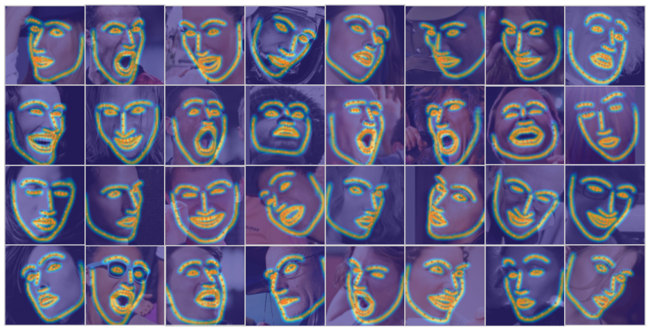
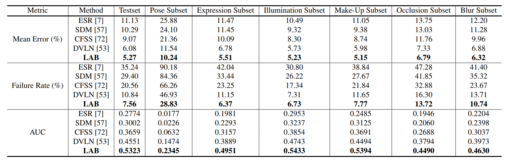

# Look at Boundary: A Boundary-Aware Face Alignment Algorithm

Created by [Wayne Wu](https://wywu.github.io/) at Tsinghua University.



We present a novel boundary-aware face alignment algorithm by utilising boundary lines as the geometric structure of a human face to help facial landmark localisation. Unlike the conventional heatmap based method and regression based method, our approach derives face landmarks from boundary lines which remove the ambiguities in the landmark definition. Three questions are explored and answered by this work: 1. Why use boundary? 2. How do you use boundary? 3. What is the relationship between boundary estimation and landmarks localisation?

Our boundary-aware face alignment algorithm achieves 3.49% mean error on 300-W Fullset, which outperforms state-of-the-art methods by a large margin. Our method can also easily integrate information from other datasets. By utilising boundary information of 300-W dataset, our method achieves 3.92% mean error with 0.39% failure rate on COFW dataset, and 1.25% mean error on AFLW-Full dataset. Moreover, we propose a new dataset Wider Facial Landmark in the Wild (WFLW) to unify training and testing across different factors, including poses, expressions, illuminations, makeups, occlusions, and blurriness. A detailed description of the system can be found in our [paper](https://wywu.github.io/projects/LAB/LAB.html).

## Citation
If you use this code or WFLW dataset for your research, please cite our papers.
```
@inproceedings{wayne2018lab,
 author = {Wu, Wayne and Qian, Chen and Yang, Shuo and Wang, Quan and Cai, Yici and Zhou, Qiang},
 title = {Look at Boundary: A Boundary-Aware Face Alignment Algorithm},
 booktitle = {CVPR},
 month = June,
 year = {2018}
}
```

## Prerequisites
- Linux
- Python 2 or 3
- CPU or NVIDIA GPU + CUDA CuDNN

## Getting Started

### Installing
0. Install prerequisites for Caffe (http://caffe.berkeleyvision.org/installation.html#prequequisites)
1. Modified-caffe for LAB (https://github.com/wywu/LAB.git)

### Wider Facial Landmark in the Wild (WFLW) Dataset Download
[Wider Facial Landmarks in-the-wild (WFLW)](https://wywu.github.io/projects/LAB/WFLW.html) is a new proposed face dataset. It contains 10000 faces (7500 for training and 2500 for testing) with 98 fully manual annotated landmarks.

0. WFLW Training and Testing images [[Google Drive](https://drive.google.com/open?id=1hzBd48JIdWTJSsATBEB_eFVvPL1bx6UC)] [[Baidu Drive](https://pan.baidu.com/s/1paoOpusuyafHY154lqXYrA)]
1. WFLW [Face Annotations](https://wywu.github.io/projects/LAB/support/WFLW_annotations.tar.gz)
2. Unzip above two packages and put them on './datasets/WFLW/'

Simply run this script to download annotations of WFLW
```bash
#! ./scripts/download/download_wflw_annotation.sh
bash ./scripts/download/download_wflw_annotation.sh WFLW
```

### Testing LAB on WFLW
We supply two pretrained models:

	WFLW_final: The final model evaluated on WFLW in the paper.
	WFLW_wo_mp: The simplified model without Message Passing layer which is much easier to read.

0. Download pretrained models: [WFLW_final](https://wywu.github.io/projects/LAB/support/WFLW_final.tar.gz) and [WFLW_wo_mp](https://wywu.github.io/projects/LAB/support/WFLW_wo_mp.tar.gz).
```bash
#! ./scripts/download/download_wflw_model.sh
bash ./scripts/download/download_wflw_model.sh WFLW
```

1. Test the model:
```bash
#! ./scripts/test/run_test_on_wflw.sh
bash ./scripts/test/run_test_on_wflw.sh final
bash ./scripts/test/run_test_on_wflw.sh wo_mp
```

The testing results will be saved to text files here: `./evaluation/WFLW/`.

### Results of WFLW_final model on WFLW




### Training
For company security considerations, it is with regret that we are not allowed to release the training scripts. However, for training, all you need to do is using this released code and adding data augmentation described in the paper. Taking the released prototxt file as reference and using the hyper-parameters described in the paper, we think it is easy to reproduce the reported performance. If you have any question about the training process, please feel free to contact us.


## To Do List
Supported dataset
- [x] [Wider Facial Landmark in the Wild (WFLW)](https://wywu.github.io/projects/LAB/WFLW.html)
- [ ] [Annotated Facial Landmarks in the Wild (AFLW)](https://www.tugraz.at/institute/icg/research/team-bischof/lrs/downloads/aflw/)
- [ ] [
Caltech Occluded Faces in the Wild (COFW)](http://www.vision.caltech.edu/xpburgos/ICCV13/)
- [ ] [300 Faces In-the-Wild (300W)](https://ibug.doc.ic.ac.uk/resources/300-W/)

Supported models
- [x] [Final Model of LAB]()
- [x] [Simplified Model of LAB without Message Passing]()


### Questions
Please contact wuwenyan0503@gmail.com
